# Newstrading Strategy

Newstrading is a scheduled, news-driven trading pipeline. For each configured watchlist symbol, it converts multi-source news into a sentiment signal, converts that signal into a confidence-scaled order recommendation, and then applies an independent pre-trade gate before routing to a paper broker or Interactive Brokers (IBKR).

## End-to-end flow

```mermaid
flowchart LR
    A[Watchlist symbol] --> B[Source news]
    B --> C[Deduplicate and normalize]
    C --> D[News batch JSON]
    D --> E[Sector keyword scoring]
    E --> F[Recency-weighted aggregation]
    F --> G[Market context adjustment]
    G --> H[Trading signal JSON\nBUY / SELL / HOLD]
    H --> I[Account snapshot]
    I --> J[Confidence-scaled sizing]
    J --> K[Order recommendation JSON]
    K --> L[Independent pre-trade checks]
    L -->|Pass| M[Paper broker or IBKR]
    L -->|Fail| N[Rejected execution report]
    M --> O[Execution report JSON]
```



The scheduler runs the stages in this order:

1. `sourcing`
2. `signaling`
3. `order_recommendation`
4. `execution`

A failure in a stage stops the pipeline for that symbol. Each stage is retried up to three times with exponential backoff.

## 1. News sourcing

`newstrading.sourcing.run_sourcing` fetches news for a symbol from the configured providers:

- Finnhub
- Polygon
- Tiingo
- Alpha Vantage
- Benzinga
- Reuters RSS
- Yahoo Finance RSS
- Google News RSS

Provider failures are logged and skipped so one unavailable provider does not discard the entire batch. Articles are deduplicated, assigned a source weight, normalized into `NewsArticle` records, and written as a `NewsBatch` artifact:

```text
newstrading/data/news_batches/<SYMBOL>/<batch_id>.json
```

The default lookback window is seven days. Articles without a valid publication time, or published outside the window, are excluded before deduplication and scoring. A demo mode is available for tests without live news providers.

## 2. Article scoring and signal generation

`newstrading.signaling.run_signaling` selects keyword sets based on the symbol's sector (`tech` or `financial`). Each article title and summary is scored as follows:

```text
raw sentiment = (positive keyword hits - negative keyword hits)
                 / max(1, positive hits + negative hits + 1)
```

The article is classified as positive or negative only when the raw score is above `0.05` or below `-0.05`; otherwise it is neutral. Topic keywords identify catalysts such as product, earnings, regulatory, or market themes.

The aggregator then:

- Applies exponential recency decay with a 72-hour time constant.
- Divides each source's contribution by the number of articles from that source, limiting duplicate coverage from one provider.
- Computes weighted average sentiment and positive-versus-negative consensus.
- Accounts for opinionated article coverage and source diversity.
- Adds `+0.15` for a bullish market trend or `-0.15` for a bearish trend.

The combined score is:

```text
combined score = 0.7 * average sentiment
               + 0.3 * consensus
               + technical adjustment
```

Decision thresholds:

- `BUY` when the combined score is at least `0.10`.
- `SELL` when the combined score is at most `-0.10`.
- `HOLD` otherwise.

Confidence is based on sentiment intensity, agreement, and coverage. It is reduced when there is only one source or when the market trend conflicts with the decision, and modestly increased when they agree. Confidence is capped at `0.95` and maps to urgency:

- `HIGH`: confidence at least `0.75`
- `MEDIUM`: confidence at least `0.40`
- `LOW`: below `0.40`

Signals are written to:

```text
newstrading/data/signals/<SYMBOL>/<signal_id>.json
```

A signal contains the decision and evidence, but intentionally does not contain order quantity or sizing fields.

## 3. Order recommendation and sizing

`newstrading.order_recommendation.run_order_recommendation` loads the latest signal and obtains an account snapshot containing cash, net liquidation value, and the current position.

Sector allocation caps are:

| Sector | Maximum allocation cap |
| --- | ---: |
| Tech | 20% |
| Financial | 15% |
| Other | 10% |

The target allocation is scaled by signal confidence:

```text
target allocation = sector allocation cap * signal confidence
```

For a `BUY`, the quantity is calculated from net liquidation value and the signal's current market price:

```text
quantity = floor(net liquidation value * target allocation / limit price)
```

For a `SELL`, the recommendation closes the existing position quantity. If there is no actionable quantity, the action becomes `HOLD`.

All recommendations currently use:

- `LIMIT` orders
- `DAY` time-in-force
- `3%` default stop-loss parameter
- `6%` default take-profit parameter
- `0.5%` maximum slippage parameter

Recommendations are written to:

```text
newstrading/data/order_recommendations/<SYMBOL>/<recommendation_id>.json
```

## 4. Final risk gate and execution

Before routing, `newstrading.execution.risk_manager` independently checks that:

- The action is not `HOLD`.
- Quantity is greater than zero.
- Quantity does not exceed `5,000` shares.
- Target allocation does not exceed `25%`.
- A positive limit price is present.

The result, including any rejection reasons, is passed to the selected broker. Paper execution writes a simulated execution report. IBKR execution supports dry-run and live modes; an order is submitted only when the explicit `--execute` flag is provided.

Execution reports are written to:

```text
newstrading/data/execution_reports/<SYMBOL>/<execution_id>.json
```

## Current operating mode

The active scheduler is configured for Interactive Brokers paper trading:

```python
BROKER = "ibkr"
EXECUTE = True
USE_LIVE_IBKR = False
RUN_INTERVAL_MINUTES = 15
```

It runs each symbol in `config/watchlist.json`, staggering symbols by five seconds. With `USE_LIVE_IBKR = False`, orders route only to the IBKR paper account. Live IBKR use requires an explicit configuration change.

## Artifact chain

Each stage communicates through JSON files rather than in-memory objects:

```text
news_batch.json
    -> trading_signal.json
    -> order_recommendation.json
    -> execution_report.json
```

This makes each decision inspectable and replayable. The signal, recommendation, and execution artifacts retain IDs linking them back to the preceding stage.

## Decision audit trail

Every scheduled cycle creates an audit record retained for 14 days:

```text
newstrading/data/audit_runs/<audit_run_id>.json
```

The audit record links each symbol's provider outcomes, raw fetched summaries and URLs, deduplication disposition, keyword hits, raw sentiment, recency and normalized weights, contribution to the aggregate score, signal calculation, order recommendation, risk-gate result, and execution report. The local dashboard exposes both run-centric and symbol-centric views of these records. Records older than 14 days are pruned at the beginning of a new scheduled cycle.

## Important limitations

- The strategy is primarily keyword and market-context driven; it does not use a trained predictive model.
- News provider quality and availability affect coverage.
- The current sizing logic uses the signal's current price as the limit price and does not model spread, liquidity, or market impact.
- The scheduler's default paper mode should be used for validation before considering live IBKR execution.

## Historical backtest

`newstrading.backtest` replays the production scoring and aggregation rules against historical Polygon company news and Yahoo Finance adjusted daily closes. Polygon is the default because the configured Finnhub endpoint returned only a recent slice for multi-year requests. Finnhub remains available with `--news-provider finnhub` after independently verifying its historical coverage. The backtest is intended to test whether recommendation direction and confidence have predictive information, not to claim that profitability is proven.

Run one symbol:

```bash
FINNHUB_API_KEY=... python -m newstrading.backtest \
    --symbol AAPL --start 2023-01-01 --end 2025-12-31
```

Run the complete configured watchlist:

```bash
FINNHUB_API_KEY=... python -m newstrading.backtest \
    --all --start 2023-01-01 --end 2025-12-31
```

The default historical provider is Polygon:

```bash
POLYGON_API_KEY=... python -m newstrading.backtest \
    --all --start 2023-01-01 --end 2025-12-31 --horizons 20
```

The default evaluation horizons are 1, 5, and 20 trading days. Results are written to `newstrading/data/backtests/` as JSON and include, per symbol and horizon:

- Pearson correlation between the continuous aggregate score and forward return. The discrete action score is retained separately for trade-direction metrics.
- OLS slope, intercept, and $R^2$ for the same continuous-score/return relationship.
- Directional hit rate and mean return for actionable recommendations.
- A simple compounded actionable-trade return.
- Buy-and-hold return over the same sample window.

To reduce look-ahead bias, each daily signal uses only articles published by 21:00 UTC on that date, uses price history available through that date for the 20-day trend context, and enters on the next trading day's close. The final days that do not have a complete requested horizon are excluded from that horizon's sample.

Interpretation should be conservative. A positive correlation or regression slope is evidence of historical association, not proof of future profit. Before using the result for a trading decision, inspect the sample count and news coverage, include commissions/slippage, reserve an out-of-sample period, and compare against the buy-and-hold benchmark. See [BACKTEST_RESEARCH.md](BACKTEST_RESEARCH.md) for the data-quality diagnosis, event-study recommendations, and model-improvement roadmap.
